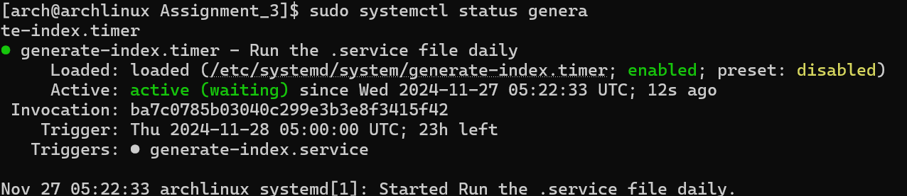
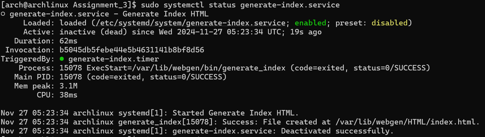
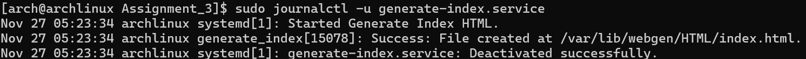

# LINUX ASSIGNMENT 3

## PART - 1

## Task 1 -> Create a system user ##

1. Create a user with the specified home directory and shell for a non-login user. Use the following command to the same:

```
sudo useradd -r -d /var/lib/webgen -s /usr/sbin/nologin webgen
```

Here; we useradd `useradd` to create a new user account on system.

- `-r`: specifies that this is a **system user**.
- `-d`: specifies the user's home directory.
- `-s`: sets the user login shell.

2. Create the necessary directories as specifd for which use:

```
sudo mkdir -p /var/lib/webgen/bin /var/lib/webgen/HTML
```

Here, `-p` will ensure that the parent directories are created if they dont really exists.For example, if `var/lib/webgen` doesn't exists, it will be created along with the subdirectories ( `bin` and `HTML` ).

3. Create the specified files.

```
sudo touch /var/lib/webgen/bin/generate_index /var/lib/webgen/HTML/index.html
```

4. Change the ownership of the above two files created to webgen user within the webgen group.

```
sudo chown -R webgen:webgen /var/lib/webgen
```

Here, 

- `-R`: recursively applies the ownership change to all the files and directories within the /var/lib/webgen .
- `webgen:webgen`: sets both, owner and group to the webgen user. This is to ensure that the user has full control over it's home directory and files.

---

## Task 2 -> Create the .service and .timer files. ##

1. Create a service file which will run the **generate_index** script using the webgen user and group.

```
sudo vim /etc/systemd/system/generate-index.service
```

2. Create a timer file which will run the service file everyday at 05:00, regardless of year, month or week.

```
sudo vim /etc/systemd/system/generate-index.timer
```

3. Refresh the systemd's configuration to make it aware of any new or altered changes in both the .service and .timer files.

```
sudo systemctl daemon-reload
```

4. Enable the timer to make sure it starts automatically.

```
sudo systemctl enable generate-index.timer
```

5. Manually start the service to test it is running without errors.

```
sudo systemctl start generate-index.timer
```

6. To verify whether the script is running correctly:

```
sudo systemctl status generate-index.timer
```

The output will look like this:


7. Do the exact same steps to enable and start the service unit file.

```
sudo systemctl enable generate-index.service
sudo systemctl start generate-index.service
```

8. Verify the execution of the script.

```
sudo systemctl status generate-index.service
```

- The output will look like this:



9. Confirm the successful execution of the file or debug any issues.

```
sudo journalctl -u generate-index.service
```
- The output will look like this:


## Task 3 - Configuring Nginx


1. Our first step is to install Nginx using this command:

```
sudo pacman -Syu nginx
```

2. Next we will configure the Nginx file.
First, we have to open it with this command:

```
sudo nvim /etc/nginx/nginx.conf
```

Second, locate `user` and to change it to:

```
user webgen;
```

> [!NOTE]
> In the script, user is loccated at the very top. Also dont forget to remove the "#" sign before it.

4. Then we will create two separate server block files instead of modifying the main nginx.conf file. This is because it is easier to manage configurations this way, and if any changes are to be made, it wouldn't affect the main nginx.conf file. 


Now, we will create a directory and name it, `sites-available`:

 ```
sudo mkdir -p /etc/nginx/sites-available
```

Then we will create the second one and name it, `sites-enable`:

```
sudo mkdir -p /etc/nginx/sites-enabled
```

5. Now we will create a new config file to create a new server block. Use the following command to do the same:

```
sudo nvim /etc/nginx/sites-available/webgen.conf
```

6. Once inside the new script, add the following contents:

```
server {
   listen 80;
   server_name localhost-webgen;

   root /var/lib/webgen/HTML;
   index index.html;

   location / {
      try_files $uri $uri/ =404;
   }
}
```

> [!NOTE]
> Replace the `server_name` to your actual ip address which you can know by using the `curl ifconfig.me` command.

- **Explanation:**

The server is set up to listen on port 80 and serve files from the /var/lib/webgen/HTML directory in response to requests to localhost-webgen by this Nginx server block. It ensures that a 404 Not Found error will be displayed for any wrong requests and that only existing files or directories are provided.

7. Next, we want to create a symbolic link in order to enable our new configuration.

This can be done by using this command:

```
sudo ln -s /etc/nginx/sites-available/webgen.conf /etc/nginx/sites-enabled/
```

8. Now we have to add a new directory in the script. Open the file using:

 `sudo nvim /etc/nginx/nginx.conf`

After it is opened, locate the http section and add the following line:

```
include /etc/nginx/sites-enabled/*.conf;
```

LIKE THIS:

![Screenshot] (sites-enable.png)


9. Confirm that the Nginx file has no errors, run this command:

```
sudo nginx -t
```
You will see something like this:


10. Restart Nginx to make suew that changes are applied.

```
sudo systemctl restart nginx
```

11. Start Nginx:

```
sudo systemctl start nginx
```


12. To confirm that Nginx is up and running, check the status:

```
sudo systemctl status nginx
```


